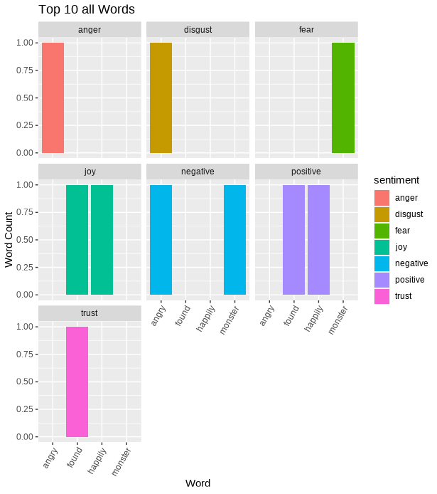
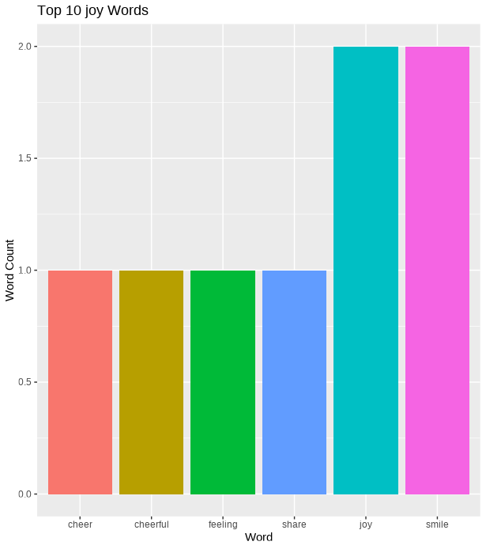

<!-- README.md is generated from README.Rmd. Please edit that file -->

# remoodji

<!-- badges: start -->

<!-- badges: end -->

Remoodji is a text analysis package that focuses on sentiment analysis
in text files in quantitative and qualitative ways. Specifically, it is
used for determining what kind of underlying emotion your input text
gives off and quantitative analyses of your text (character, word, and
sentence count as well as visual and quantitative sentiment analysis).
The emotions analyzed include angry, sad, happy, and disgust. Another
core feature of Remoodji is it replaces words with emojis to provide the
user with a text file where it is easier to pick up on the emotions
being conveyed in a visually appealing snapshot view. This package can
be useful when proofreading an important message which you want to
elicit a certain emotion or tone, particularly with a given pattern or
rhythm (speeches, letters, applications, songs, poems, etc).

## Installation

You can install the released version of remoodji from
[CRAN](https://CRAN.R-project.org) with:

    install.packages("remoodji")

And the development version from [GitHub](https://github.com/) with:

    # install.packages("devtools")
    devtools::install_github("UBC-MDS/remoodji")

# Functions

Counter:

-   With an input of textfile it will output a dataframe with character
    count, word count, and sentence count.

Sentiment Analysis Dataframe:

-   With an input of a textfile it will output a dataframe with
    sentiment analysis (e.g. sentiment type, sentiment words, and
    percentage of overall sentiment per emotion).

Character Replacement:

-   With the input of a textfile and the ability to choose which
    emotions you would like to replace (e.g. certain emotions or all) it
    will output a textfile that has emotional words replaced with
    emojis.

Sentiment Analysis Plot:

-   With the input of a dataframe from the sentiment analysis function
    it will output a visualization on the most emotionally charged words
    that appear in the text.

# Usage

Here is a example of how this package could be used. Let’s say there is
a statement that you are trying to analyze. This is how you could
implement our package.

First you need to import this package with the following command:

`library('remoodji')`

Let’s say you have the following statement:

`I was happily walking. I then saw a monster and I got scared. However, when I found out it was a prank I became angry instead.`

To start you might want to first determine the number of characters,
words, and sentences to ensure that your statement fits within
guidelines.

`counter('I was happily walking. I then saw a monster and I got scared. However, when I found out it was a prank I became angry instead.')`

This would output a tibble with the following values:

<table>
<thead>
<tr class="header">
<th>char_count</th>
<th>word_count</th>
<th>sentence_count</th>
</tr>
</thead>
<tbody>
<tr class="odd">
<td>126</td>
<td>26</td>
<td>3</td>
</tr>
</tbody>
</table>

After you have some insight into the length of your statement you would
want to get a dataframe that will provide you with some statistics about
the emotional content of your statement.
`sentiment_df("I was happily walking. I then saw a monster and I got scared. However, when I found out it was a prank I became angry instead.")`

<table>
<thead>
<tr class="header">
<th>word</th>
<th>sentiment</th>
<th>num_of_word</th>
<th>word_sent_percentage</th>
<th>sentiment_count</th>
</tr>
</thead>
<tbody>
<tr class="odd">
<td>angry</td>
<td>anger</td>
<td>1</td>
<td>0.143</td>
<td>1</td>
</tr>
<tr class="even">
<td>angry</td>
<td>disgust</td>
<td>1</td>
<td>0.143</td>
<td>1</td>
</tr>
<tr class="odd">
<td>angry</td>
<td>negative</td>
<td>1</td>
<td>0.143</td>
<td>3</td>
</tr>
<tr class="even">
<td>found</td>
<td>joy</td>
<td>1</td>
<td>0.143</td>
<td>2</td>
</tr>
<tr class="odd">
<td>found</td>
<td>positive</td>
<td>1</td>
<td>0.143</td>
<td>2</td>
</tr>
<tr class="even">
<td>found</td>
<td>trust</td>
<td>1</td>
<td>0.143</td>
<td>1</td>
</tr>
<tr class="odd">
<td>happily</td>
<td>joy</td>
<td>1</td>
<td>0.143</td>
<td>2</td>
</tr>
<tr class="even">
<td>happily</td>
<td>positive</td>
<td>1</td>
<td>0.143</td>
<td>2</td>
</tr>
<tr class="odd">
<td>monster</td>
<td>fear</td>
<td>1</td>
<td>0.143</td>
<td>1</td>
</tr>
<tr class="even">
<td>monster</td>
<td>negative</td>
<td>1</td>
<td>0.143</td>
<td>3</td>
</tr>
<tr class="odd">
<td>prank</td>
<td>negative</td>
<td>1</td>
<td>0.143</td>
<td>3</td>
</tr>
<tr class="even">
<td>prank</td>
<td>surprise</td>
<td>1</td>
<td>0.143</td>
<td>1</td>
</tr>
</tbody>
</table>

Now you might want to take this tabular / text data and turn it into a
data visualization so that you can better understand the breakdown of
emotions used in your statement.

`sentiment_plot(text = "I was happily walking. I then saw a monster and I got scared. However, when I found out it was a prank I became angry instead.", sentiment_input = "all")`

Also you could change the sentiment parameter to only see words with one
type of sentiment

`sentiment_plot(text = "This week, show us a smile (yours or someone else's), make us smile, or both. Share a photo of something that has brought a moment of joy into your life recently, or focus on the outcome of that joy. If you're not feeling particularly cheerful at the moment — it's still 2018, after all — no need to fake your way into the challenge, either. Smiles come in all shades and flavors, including the half-hearted, tired, bitter, and resigned (to name a few). So whether the emotions you channel in your photo are full of cheer or not, I can't wait to see your take on this theme." , sentiment_input = "joy")`

Lastly, you might want to visualize the emotions in this statement in a
different way. This packages allows you to see the emotional words
replaced with corresponding emojis for each type of emotion.
`textsentiment_to_emoji("I was happily walking. I then saw a monster and I got scared. However, when I found out it was a prank I became angry instead.")`
“➕” “😨” “😄” “➖” “➖”

# Contribution to Ecosystem

-   While [tidytext](https://github.com/juliasilge/tidytext) (R) and
    [nltk](https://github.com/nltk/nltk) (Python) already exist, this
    package takes it a step further by providing qualitative sentiment
    analysis in a visually appealing format by replacing emotional words
    with emojis and further analyzing text data to provide more
    quantitative sentiment analysis.
-   We also add visualizations to further this quantitative sentiment
    analysis in a way that these packages do not.

# Dependencies

-   tidyverse
-   dplyr
-   tidytext
-   textdata
-   emojifont

# Contributors

-   [Aidan Mattrick](https://github.com/aidanmattrick)
-   [Kevin Shahnazari](https://github.com/kshahnazari1998)
-   [Zhanyi Su](https://github.com/YikiSu)
-   [Rachel Wong](https://github.com/rachelywong)

### Credits

This package was created with Devtools from R packages by Hadley Wickham
and Jenny Bryan (<https://r-pkgs.org/index.html>).
